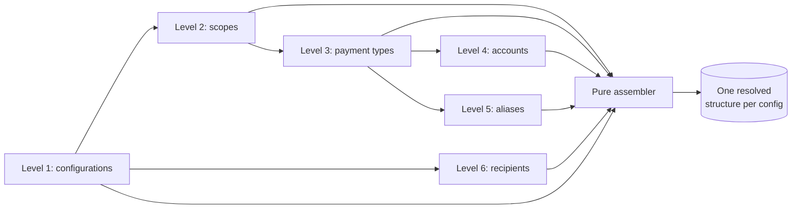

# Commander — Data Retrieval

## 1. Purpose & Scope

This document is a companion to Commander's main solution document (`solution-document-commander.md`), which describes the CAMT report-generation system as a whole. Here, we go into full depth on one piece of that system: Data Retrieval, the capability Assembly calls into to turn a set of report configurations into everything needed to build their requests.

Data Retrieval reads a set of report configurations and resolves each one into a complete structure: every property on the configuration itself, its recipient, and its whole scope tree underneath — the payment types it covers, and under each, either the accounts or the aliases it applies to. It doesn't decide which configurations are due (that's Scheduling), and it doesn't build or send a request (that's Assembly) — it turns "here are some configuration ids" into "here's everything about them," nothing more.

Data Retrieval is documented separately because, like Scheduling, its interface to Assembly is small and stable: Assembly hands it a set of configurations — or, during recovery, a set of already-known pieces of work to check on again — and gets back resolved data. That narrow interface is what makes it self-contained enough to describe in the depth an implementer needs, without requiring every reader of the main document to wade through it.

Data Retrieval is read-only and stateless. Many pods call into it at once, with no coordination needed between them, and "the data as of when this call reads it" is good enough — a configuration edited mid-run is simply picked up on the next run, never retroactively reflected in one already in progress.

## 2. How Resolution Works

Every call into Data Retrieval — resolving a page of scheduled configurations, a short on-demand list, or one inbound-balance-push configuration — costs the same six database reads, one per level of a configuration's structure:

1. the configuration itself
2. its scopes
3. the payment types under each scope
4. the accounts under each payment type
5. the aliases under each payment type
6. the recipients

Everything after that is stitched together in memory, with no further database access, into one fully-resolved structure per configuration.

This shape is deliberate: the cost scales with how many pages get resolved, not with how many configurations there are or how wide any one configuration is. Resolving one configuration at a time would cost roughly five reads for every single configuration — at 10,000 configurations, tens of thousands of round trips. Batching by page instead brings a 5,000-configuration run down to around ten pages, roughly sixty round trips total.

### What comes back for each configuration

A fully-typed structure — every property on the configuration, named individually, not a loose bag of values; its recipient; and its scope tree underneath, payment types and, under each, either its accounts or its aliases, never both. A configuration with no scope at all still resolves cleanly, just with an empty tree instead of an error.

Both the configuration's internal identity and its business-facing configuration id are carried through, since different callers need different ones: Assembly's own tracking keys on the internal identity (stable, never reused), while an on-demand caller addresses configurations by the business one.

### The recipient

Every configuration resolves to exactly one recipient — the entity the eventual report is addressed to. Recipients are resolved in the same batched way as everything else: the distinct recipient ids across a whole page are looked up in one read, not one lookup per configuration.

### Two ways to call in

Fresh resolution and recovery are genuinely different questions, so they're two separate entry modes built on the same underlying reads:

- **Fresh resolution** — for a set of configurations that haven't been resolved before this call. The configuration set can come from any of Assembly's three trigger entry points: a page of scheduled configurations, an on-demand caller's list of configuration ids, or — for an inbound account balance push — the single configuration belonging to the recipient the push identifies.
- **Recovery** — for pieces of work Assembly already committed to (existing WorkItems) and now needs to check on again after a crash. This asks a different question: not "what configurations are due," but "for this specific piece of work, does it still exist?"

### Recovery's three-way answer

A configuration or one of its scopes can genuinely disappear between when a piece of work was first planned and when recovery checks on it again — deactivated, or deleted outright. Recovery has to tell that apart from a database hiccup, since the two need completely different responses: a hiccup should be retried; a genuine removal should be recorded and moved on from, not retried forever.

So recovery answers with one of three outcomes for each piece of work it checks:

- **Found** — the data is still there; here it is, current as of this check.
- **Confirmed absent** — the resolution succeeded, and this specific piece of work is genuinely gone — its configuration or scope was removed or deactivated since the original attempt.
- **Query failed** — a lookup itself failed or timed out. This says nothing about whether the work still exists; it's a transient problem, not an answer.

Recovery's own lookup deliberately does not filter out inactive configurations the way fresh resolution does — it needs to be able to see a configuration that's since gone inactive, not just skip past it, precisely so it can tell "still there" apart from "genuinely gone."

New work that would exist today but didn't exist at the time of the original attempt is never picked up by recovery — it only ever answers for work already committed to, it doesn't go looking for anything new.

### Matching one piece of work back to its data

Every piece of work Assembly creates needs a precise way to say which part of a configuration's resolved tree it's for, so recovery can look that exact piece up again later. That identity is a short, deterministic, human-readable string — the same identity that feeds directly into the fingerprint Assembly builds for each request (the "data slice" component — `solution-document-commander.md`, 1.6 Assembly):

- **One account** (unbundled) — points at that specific account, under a payment type of that kind.
- **One alias** (unbundled) — points at that specific alias, likewise.
- **The whole configuration** (bundled) — points at the configuration's entire current tree; a bundled configuration always produces exactly one piece of work, never one per payment type, matching the bundling rule's one-request-per-bundled-configuration shape.
- **The configuration itself** (no scope) — points at just the configuration row.

### The inbound account balance push's extra step

An inbound account balance push resolves its one configuration the same way as any other, then does one extra, purely in-memory step: the pushed message's account balances are matched against the resolved accounts by clearing number and account number. A match carries the pushed balance forward into the result; an account the push didn't cover is dropped from that result entirely, since a push only ever reports on the accounts it actually carries. Aliases are untouched by this step.

## 3. Architecture

### Logical components

- **The staged reads** — six batched database reads, one per level of the configuration hierarchy, each keyed off the ids the previous level produced.
- **The pure assembler** — a database-free function that groups the flat rows from all six reads by parent id and builds each configuration's resolved tree.
- **Fresh-resolution entry point** — the three ways a set of configurations gets selected (scheduled page, on-demand list, inbound-push single configuration), each feeding the same shared reads from level two onward.
- **Recovery entry point** — resolves specifically the configurations behind an already-known set of pieces of work, without filtering out inactive ones, and answers with the found / confirmed-absent / query-failed outcome for each.
- **Page-width guards** — independent of how many configurations are in a page, protect against any single configuration, or the page as a whole, resolving to an unreasonable amount of data.

### Interface to Assembly

- Assembly calls Data Retrieval's fresh-resolution entry point with a set of configurations, from any of its three trigger entry points, and gets back one fully-resolved structure per configuration.
- Assembly's watchdog calls Data Retrieval's recovery entry point with the set of pieces of work it already knows about, and gets back a found / confirmed-absent / query-failed outcome for each.
- The identity Data Retrieval assigns to each piece of a configuration's tree feeds directly into the fingerprint Assembly builds for every request (`solution-document-commander.md`, 1.6 Assembly).

## 4. Why It's Built This Way

1. **Batched, staged reads over one query per configuration.** Resolving one configuration at a time would cost roughly five database round trips for every single configuration — at ten thousand configurations, tens of thousands of round trips per run. Batching by page instead makes the cost scale with how many pages get resolved, not how many configurations or how wide any one of them is.

2. **Six separate staged reads over one big combined query.** A single wide query joining every level together multiplies rows at every level a configuration has scope under — a configuration with a handful of scopes, payment types, and accounts can turn into many times more rows than real accounts, most of it repeated copies of the same configuration and recipient data. Staged reads fetch each configuration row and each recipient row exactly once, and let a failure on one level (say, a transient timeout resolving accounts) be retried narrowly, without discarding whatever the other levels already successfully resolved.

3. **Six separate staged reads over one server-side stored procedure.** A stored procedure doing the whole walk in one round trip saves only a small, roughly fixed amount of latency per page — it doesn't change how many times a table actually gets touched, since the same reads still have to happen somewhere. In exchange it moves real application logic into the database as a separately versioned object, complicates testing (only realistically exercisable against a real database, rather than fast unit tests against each staged read), and doesn't naturally support the recovery path's different question — "does this specific piece of work still exist" — without a second procedure or a mode flag.

4. **A recovery-specific presence check, not just re-running fresh resolution.** Fresh resolution and recovery ask genuinely different questions — "what's due" versus "does this already-planned piece of work still exist" — and conflating them would lose the distinction recovery needs: whether a piece of work is gone because of a real, permanent change, or because of a passing database problem. Recovery's own configuration lookup deliberately doesn't filter out inactive configurations, specifically so it can tell those two apart.

5. **Page-width guards, independent of page-count limits.** How many configurations are in a page is controlled directly, but that alone doesn't bound how much data one very large configuration can produce — a single bundled configuration with an unusually large number of accounts can make a page's memory footprint blow up on its own, regardless of how few configurations share that page. A configuration that resolves to an unreasonable amount of data is treated as bad data — logged, alerted, and handed back as a failed item — rather than silently truncated or allowed to threaten the pod's memory.

## 5. Operational Workflows

### A. Fresh resolution

1. Assembly selects the set of configurations to resolve — the next page of scheduled configurations, a caller-supplied on-demand list, or, for an inbound account balance push, the single configuration belonging to the identified recipient.
2. Data Retrieval reads that configuration set, then its scopes, payment types, accounts, aliases, and recipients — six reads total, regardless of how many configurations are in the set.
3. The results are assembled in memory into one fully-resolved structure per configuration, with no further database access.
4. For an inbound account balance push only: the pushed balances are merged into the resolved accounts, matched by clearing number and account number; unmatched accounts are dropped from the result.
5. Assembly takes the resolved data from there — deciding the request shape, building the request(s), writing them to the outbox.

### B. Recovery

1. Assembly's watchdog (`solution-document-commander.md`, 1.7 Assembly D) identifies the pieces of work — already-known WorkItems — that need to be checked on again.
2. Data Retrieval looks up the configurations behind those pieces of work, without filtering out inactive ones, then resolves the same six levels for whichever configurations are still present.
3. For each piece of work: if its configuration is gone or inactive, it's confirmed absent, along with every other piece of work under that same configuration. If the configuration is active, its specific piece — one account, one alias, the whole bundled tree, or just the configuration itself — is looked up in the freshly-resolved data: present is found, with the current data; absent is confirmed absent.
4. If a read itself fails or times out, every piece of work in that batch gets query failed instead — never confused with confirmed absent.
5. Assembly acts on each outcome: found means rebuild and publish; confirmed absent means mark the WorkItem obsolete; query failed means retry, the same as any other transient failure.

### C. When a configuration or the page itself is too wide

- A configuration that resolves to more accounts than a configured ceiling is treated as bad data, not built — logged, alerted, and handed back as a failed item, the same as any other poison configuration. The rest of the page keeps resolving around it.
- Independent of that per-configuration ceiling, a hard cap on the total amount of data accumulated while resolving one page protects against the page as a whole growing unbounded, even if the per-configuration ceiling is set generously.
- A configuration whose payment-type assignment carries both accounts and aliases at once — which should never happen — is likewise isolated as bad data rather than failing the whole page. A single occurrence is almost certainly a real data problem; a high rate of it across a page or run is more likely a bug in the reads themselves, and is worth alerting on more loudly than an ordinary bad-data case.

## 6. Assumptions

- The database's existing indexes already support the access patterns these reads depend on — paging configurations by their identity, and looking up children by their parent's identity at every level. This is a prerequisite to verify, not something this layer adds.
- Resolving a page's worth of accounts, payment types, and aliases in one batched read, rather than one query per configuration, may require one general-purpose addition to the existing database schema. Whether that addition is acceptable is still open to confirm; a fallback exists (splitting a large batch into smaller ones) but gives up some of the flat per-page cost this design otherwise achieves.
- The identity format used to match a recovered piece of work back to its data needs to be agreed jointly with Assembly, since the same identity feeds directly into Assembly's own fingerprint and duplicate-prevention keys.
- Per-configuration and per-page size ceilings are configured defaults, not yet set from real, measured data — they should be tuned once real configuration-to-account ratios are known.

## 7. Implementation Reference

<!-- Deferred, same phased approach used for commander-scheduling.md: build out Section 1-6
     first, review, then add exact SQL, TVP details, the ResolvedConfig record shape, and
     configuration defaults here. Source: 02-design/data-retrieval/solution_v02.md. -->
