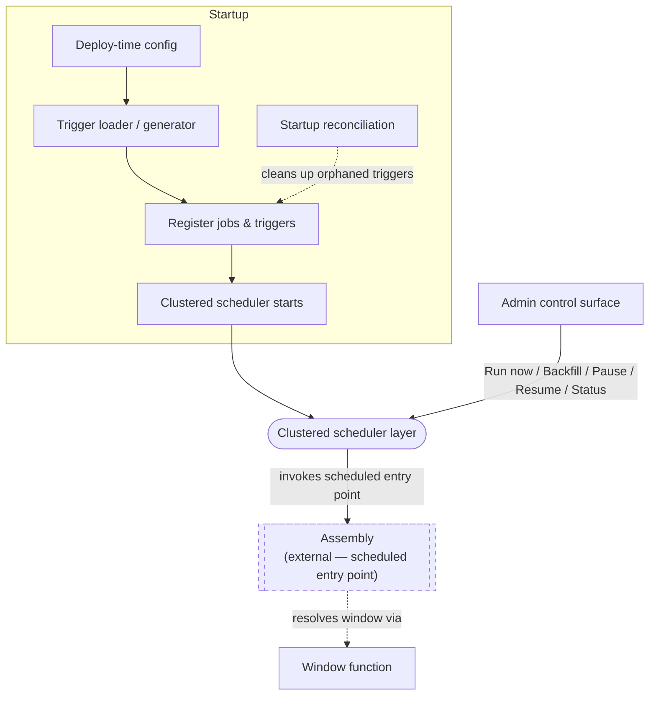

# Commander — Scheduling (Infrastructure Setup)

## 1. Purpose & Scope

This document is a companion to Commander's main solution document (`solution-document-commander.md`), which describes the CAMT report-generation system as a whole. Here we go into full depth on one piece of that system: Scheduling, the part of Commander that decides when a report is due.

Scheduling reads and validates a deploy-time Quartz scheduling configuration describing each report's cadence, builds and registers the corresponding jobs and triggers with a clustered scheduler, keeps that registration clean across redeploys, and runs the scheduler that fires them. It also exposes two supporting capabilities: a window-calculation function, and an admin control surface operators use to run, pause, resume, or recover a schedule.

Scheduling's involvement in any one firing ends the moment it invokes Assembly's scheduled entry point. It hands off and steps away. It does not decide what a report should contain, does not create any tracking record, and does not know whether that firing eventually succeeds. From that point on, everything is Assembly's responsibility, described in the main solution document.

## 2. How Report Timing Works

Every report frequency falls into one of three window shapes:

- **Rolling** — a fixed look-back ending at the fire time (e.g. the last 30 minutes).
- **Boundary** — the stretch since the previous checkpoint today, with midnight as an implicit first checkpoint. A *checkpoint* is one of the times in the frequency's boundary list; the previous checkpoint and the current one bracket the window.
- **Calendar-day** — the entire previous calendar day, delivered the next morning.

All window math happens in one configured business timezone (Europe/Stockholm) and is converted to absolute time for the outgoing request.

> **On "absolute time":** an absolute time is a timezone-independent point in time — an instant, like a UTC timestamp — rather than a wall-clock reading tied to a particular timezone. The window math happens in local business time ("13:00 in Europe/Stockholm on 2026-09-18"), but that reading is ambiguous without knowing which timezone and which DST rules applied that day. Converting to an instant before it goes out means Executor (or anyone else reading the request) gets one unambiguous moment, and doesn't need to know anything about Europe/Stockholm or its DST rules.

### Daylight saving

Clocks skip an hour forward each spring and repeat an hour each autumn. A fire time in the skipped stretch shifts forward to the next real moment; one in the repeated stretch fires once, at its first occurrence, and not again the second time around.

Rolling frequencies:

| Frequency | Fires in 02:00–03:00 (nominal) | Spring (hour is skipped) | Autumn (hour repeats) |
|---|---|---|---|
| `EVERY_1_HOUR` | 02:00 | Doesn't happen. The next fire is the regular 03:00, whose window collapses to zero length. | Fires once, at the first pass (window 01:00–02:00, first pass). The regular 03:00 fire picks up from there (window 02:00–03:00, spanning the repeat). |
| `EVERY_30_MIN` | 02:00, 02:30 | Neither happens. Same as above. | Each fires once, at its first pass. |

The "Fires in 02:00–03:00" column describes the nominal case; on a DST-transition day the actual fires differ as shown.

Boundary frequencies:

| Boundary situation | Fires in 02:00–03:00 | Spring (hour is skipped) | Autumn (hour repeats) |
|---|---|---|---|
| A boundary itself falls at 02:00 or 02:30 (hypothetical — no current boundary does) | 02:00 or 02:30 | Shifts forward to fire at 03:00. If another boundary is already scheduled at 03:00, the two resolve to the same scheduled slot and collapse into one report — the shifted boundary does not get a separate window of its own that day. If not, the shifted firing simply becomes that day's 03:00 boundary. | Fires once, at its first occurrence. The second pass is suppressed the same way any other trigger's repeat is. The window is computed normally from whichever boundary preceded it; no distortion for that specific window. |

No boundary checkpoint currently sits inside the 02:00–03:00 transition window. The table describes what *would* happen, not something exercised today; the rule stays in place for whenever a boundary list changes to include one.

A window can also simply span a transition, without any boundary falling inside the gap or overlap. The same number of reports is still produced — nothing is skipped or duplicated — but one of those windows ends up covering an hour more or less of real time than it normally would.

- For a Boundary window, `EVERY_2_HOURS`' 00:00–03:00 window is ~2 elapsed hours on the spring-transition day and ~4 on the autumn one.
- For a Calendar-day window, the end-of-day window is 23 hours on the spring transition and 25 on the autumn one.

This is distinct from the table above, which is about a boundary landing directly inside the gap or overlap.

### Frequency catalogue

| Report type(s) | Frequency | Shape | Fires at | Days | Reporting window |
|---|---|---|---|---|---|
| CAMT052B, CAMT052BT | Every 30 min (`EVERY_30_MIN`) | Rolling | 00:30 → 21:00 | Mon–Fri | last 30 min |
| CAMT052B, CAMT052BT | Every hour (`EVERY_1_HOUR`) | Rolling | 01:00 → 21:00 | Mon–Fri | last 60 min |
| CAMT052B, CAMT052BT | Every 2 h (`EVERY_2_HOURS`) | Boundary | 03:00, 05:00 … 21:00 | Mon–Fri | since previous checkpoint; first run covers 00:00–03:00 |
| CAMT052B, CAMT052BT | Every 4 h (`EVERY_4_HOURS`) | Boundary | 05:00, 09:00, 13:00, 17:00, 21:00 | Mon–Fri | since previous checkpoint; first run covers 00:00–05:00 |
| CAMT054C | Once a day (`ONCE_PER_DAY`) | Boundary | 21:00 | Mon–Fri | 00:00–21:00, same day |
| CAMT054C | 4× a day (`FOUR_TIMES_PER_DAY`) | Boundary | 10:00, 13:00, 18:00, 21:00 | Mon–Fri | since previous checkpoint; first run covers 00:00–10:00 |
| CAMT054C | 8× a day (`EIGHT_TIMES_PER_DAY`) | Boundary | 03:00, 06:00, 08:00, 10:00, 12:00, 15:00, 18:00, 21:00 | Mon–Fri | since previous checkpoint; first run covers 00:00–03:00 |
| CAMT053S, CAMT053E, CAMT054D | End of day (`END_OF_DAY`) | Calendar-day | 06:00 | Tue–Sat | the whole previous calendar day |
| any of the above | Never (`NEVER`) | — | not scheduled | — | — |

`NEVER` marks configurations that are recipients of the inbound account-balance-push flow, triggered by an event rather than a timetable. No schedule ever picks a `NEVER` config up; the scheduled selection query structurally excludes it.

21:00 → 24:00 is never reported same-day by any Rolling or Boundary frequency, since their last checkpoint is 21:00. Only `END_OF_DAY` covers that stretch, and it does so the following morning, as part of the previous calendar day.

`ONCE_PER_DAY` describes cadence, not window shape. It is a Boundary window ending at 21:00, not a Calendar-day window covering the whole previous day. "Once per day" does not imply end-of-day semantics.

## 3. Architecture

### Logical components

- **Trigger loader / generator** — reads the deploy-time schedule configuration, expands any entry that lists several report types into one independent schedule per report type, generates the underlying cron timing expression(s) from each schedule's interval or boundary-list specification, and builds and registers the resulting job and trigger definitions with the clustered scheduler at startup.
- **Startup reconciliation** — also at startup, before the scheduler begins running, removes any triggers left over from a prior configuration so nothing fires against a stale schedule.
- **Clustered scheduler layer** — fires triggers such that exactly one pod across the deployment handles any given firing, with job recovery enabled so a firing is never silently lost if its pod dies before completing. Quartz re-fires it on a live pod.
- **Admin control surface** — an authenticated, admin-only set of actions (Run now, Backfill, Pause, Resume, Status), addressed by (report type, frequency).
- **Window function** — a pure calculation that resolves a scheduled fire time to a (window start, window end) pair, exposed as a shared capability Assembly calls into.



### Interface to Assembly

- Scheduling invokes Assembly's scheduled-trigger entry point directly when a registered trigger fires, passing it that trigger's own configuration data: report type, frequency, scheduled fire time.
- Assembly calls Scheduling's window function to resolve a fire time into a (window start, window end) pair.
- A test-only override lets a schedule fire on a fast cadence instead of waiting for real clock time. This still produces a fresh, distinct request on every tick, even for End-of-day, because Assembly derives each scheduled request's identity from the scheduled fire time rather than the reporting window. A different fire time is a different identity, regardless of how often the window itself actually changes.

## 4. Why It's Built This Way

1. **Do-nothing misfire policy; recovery only via explicit Backfill.** A missed firing is never caught up automatically. The timetable resumes at its next natural time. Automatic catch-up would turn "how much has been missed, and does it still matter" into a decision the system makes silently. Do-nothing keeps that decision deliberate and visible, made once by an operator via Backfill, for the slots that still matter.

2. **Crons are generated from declarative configuration, never hand-authored.** An operator describes a schedule in plain terms — report types, frequency, days, and either an interval or an explicit list of boundary times — and the trigger loader derives the cron expression. The same boundary list drives the window calculation. If the cron were hand-written separately, the two could drift apart.

3. **One job class, parameterized per schedule.** Report type, frequency, and window specification live in each job's own configuration data, not in a separate subclass. Scheduling logic stays in one place regardless of how many report-type/frequency combinations exist. Adding a new one is a configuration change, not a code change.

4. **`EVERY_2_HOURS` and `EVERY_4_HOURS` are Boundary, anchored to midnight, not Rolling.** Anchoring to midnight means the first window of the day starts at 00:00 — no gap between midnight and the first firing — and brings these two in line with `ONCE_PER_DAY`, `FOUR_TIMES_PER_DAY`, and `EIGHT_TIMES_PER_DAY`.

5. **Clustered scheduler, job recovery on.** Clustered mode means one pod picks up any given firing. Job recovery means a firing isn't lost if that pod dies before completing. Assembly has its own recovery, but only for work it already knows about; job recovery covers the gap before the handoff (7.2). After that, what happens is Assembly's problem.

6. **Daylight-saving rules are pinned, not inherited from a library default.** The shift-forward and fire-once behaviours (Section 2) are implemented as a named resolver with their own tests. How Scheduling behaves across a clock transition is a decision we made, not an accident of whichever library version is running.

7. **One uniform set of admin actions, addressed by (report type, frequency).** Run now, Backfill, Pause, Resume, and Status address a schedule the same way regardless of window shape, so operators have one mental model for controlling any schedule.

## 5. Operational Workflows

### A. Startup

1. The deploy-time schedule configuration is read.
2. It is validated. Startup fails loudly if:
   - a schedule's frequency does not parse to a known value;
   - a Boundary schedule's boundary list is empty, not strictly ascending, or includes 00:00 explicitly (the loader prepends the implicit leading 00:00 itself, so an explicit entry is ambiguous);
   - a schedule has neither an interval nor a boundary list, or, for Calendar-day, no fire-at time;
   - the same (report type, frequency) appears in more than one entry;
   - an active report configuration exists whose (report type, frequency) has no matching schedule — a case that would otherwise silently never produce anything.
3. Any entry listing several report types is expanded into one independent schedule per report type, and the underlying cron timing expression(s) are generated from each schedule's interval or boundary-list specification.
4. The resulting job and trigger definitions are built and registered with the clustered scheduler.
5. Any triggers left over from a prior configuration are cleaned up, before the scheduler begins running.
6. The clustered scheduler starts.

### B. Admin actions

- **Run now** — fires the schedule immediately, using the current moment as the scheduled fire time by default, and invokes Assembly's entry point the same way a normal firing would. An optional scheduled-time override lets it target a specific slot, for ad-hoc or testing use; recovering a real missed slot as standard operating procedure is Backfill's job. See 7.5 for how the two differ.
- **Backfill** — fires the schedule again for a specific missed slot, passing that slot's original scheduled time rather than the current moment, so the report covers the period it was always meant to. Available for any missed slot, sub-daily or end-of-day alike. Safe to reissue for a slot that already ran: invoking Assembly's entry point twice for the same slot is a no-op on Assembly's side (see the main solution document, Assembly). Backfill only ever re-runs a slot that a real schedule would have produced, using that slot's own window. Producing a report for an arbitrary historical window or an arbitrary list of configuration ids is an on-demand request, not a Backfill.
- **Pause** — stops a schedule, addressed by report type and frequency, from firing going forward. Used to protect production during an environment issue, or once an operator has been informed of a database or message-queue problem.
- **Resume** — resumes a paused schedule; firing continues at its next natural time.
- **Status** — reports a schedule's paused/active state, its last and next fire time, and whether the most recent fire invoked Assembly or was skipped by the window function (7.3). It does not report whether the invoked work succeeded; that is Assembly's concern.

Misfire policy: a firing that is missed, whether from an outage or a deliberate pause, is not caught up. The timetable resumes at its next natural time. Recovering a missed slot is always a deliberate action — Backfill, above.

## 6. Assumptions

- The business day is Monday to Friday. There is no holiday calendar. A weekday holiday still runs its scheduled firings and produces a (possibly near-empty) report.
- Quartz's job store lives in the same database as everything else. If that database is down, Quartz can't tell what's due and can't coordinate pods — so Scheduling stops. Nothing fires until the database is back.
- This isn't something Scheduling can work around. It does mean a database outage needs infrastructure-level alerting, because Scheduling's own alerting depends on Scheduling being up. A database outage is the most likely cause of "the whole cluster is down," and it's handled like any other outage: nothing is caught up automatically, and recovering the slots that matter is a Backfill once the database is healthy (5, B).
- Quartz's cluster coordination is database-mediated, so fire times are computed from each pod's own clock. Clock skew across pods does not break the "exactly one pod handles any given firing" guarantee, but it can affect which pod picks up a firing and when the firing is observed. Pod clocks are expected to be NTP-synchronized by the platform; Scheduling does not compensate for skew itself.

## 7. Implementation Reference

This section is the implementation-level companion to the rest of the document: the exact configuration schema, generated cron expressions, Quartz job/trigger wiring, admin-endpoint payloads, and edge cases the earlier sections leave out on purpose. The earlier sections are authoritative for design and reasoning; come here when building or reviewing the code. Nothing here should contradict them.

### 7.1 Configuration (deploy-time, via properties)

Fixed at deploy time, changed by redeploy. Each entry carries only the meaningful inputs; the trigger loader derives the crons.

```properties
commander.scheduling.timezone = Europe/Stockholm

# Rolling
commander.scheduling.triggers[0].report-types   = CAMT052B, CAMT052BT
commander.scheduling.triggers[0].frequency      = EVERY_30_MIN
commander.scheduling.triggers[0].days           = MON-FRI
commander.scheduling.triggers[0].shape          = ROLLING          # ROLLING | BOUNDARY | CALENDAR_DAY
commander.scheduling.triggers[0].interval       = { first: 00:30, step: 30m, last: 21:00 }
                                                 # two physical crons (7.2) — no single cron hits exactly 00:30 ... 21:00

commander.scheduling.triggers[1].report-types   = CAMT052B, CAMT052BT
commander.scheduling.triggers[1].frequency      = EVERY_1_HOUR
commander.scheduling.triggers[1].days           = MON-FRI
commander.scheduling.triggers[1].shape          = ROLLING
commander.scheduling.triggers[1].interval       = { first: 01:00, step: 1h, last: 21:00 }

# Boundary, via interval spec — regular spacing
commander.scheduling.triggers[2].report-types   = CAMT052B, CAMT052BT
commander.scheduling.triggers[2].frequency      = EVERY_2_HOURS
commander.scheduling.triggers[2].days           = MON-FRI
commander.scheduling.triggers[2].shape          = BOUNDARY
commander.scheduling.triggers[2].interval       = { first: 03:00, step: 2h, last: 21:00 }
                                                 # implicit leading 00:00 → first window is 00:00–03:00

commander.scheduling.triggers[3].report-types   = CAMT052B, CAMT052BT
commander.scheduling.triggers[3].frequency      = EVERY_4_HOURS
commander.scheduling.triggers[3].days           = MON-FRI
commander.scheduling.triggers[3].shape          = BOUNDARY
commander.scheduling.triggers[3].interval       = { first: 05:00, step: 4h, last: 21:00 }
                                                 # implicit leading 00:00 → first window is 00:00–05:00

# Boundary, via explicit list — irregular spacing
commander.scheduling.triggers[4].report-types   = CAMT054C
commander.scheduling.triggers[4].frequency      = ONCE_PER_DAY
commander.scheduling.triggers[4].days           = MON-FRI
commander.scheduling.triggers[4].shape          = BOUNDARY
commander.scheduling.triggers[4].boundaries     = 21:00

commander.scheduling.triggers[5].report-types   = CAMT054C
commander.scheduling.triggers[5].frequency      = FOUR_TIMES_PER_DAY
commander.scheduling.triggers[5].days           = MON-FRI
commander.scheduling.triggers[5].shape          = BOUNDARY
commander.scheduling.triggers[5].boundaries     = 10:00, 13:00, 18:00, 21:00

commander.scheduling.triggers[6].report-types   = CAMT054C
commander.scheduling.triggers[6].frequency      = EIGHT_TIMES_PER_DAY
commander.scheduling.triggers[6].days           = MON-FRI
commander.scheduling.triggers[6].shape          = BOUNDARY
commander.scheduling.triggers[6].boundaries     = 03:00, 06:00, 08:00, 10:00, 12:00, 15:00, 18:00, 21:00

# Calendar-day
commander.scheduling.triggers[7].report-types   = CAMT053S, CAMT053E, CAMT054D
commander.scheduling.triggers[7].frequency      = END_OF_DAY
commander.scheduling.triggers[7].days           = TUE-SAT
commander.scheduling.triggers[7].shape          = CALENDAR_DAY
commander.scheduling.triggers[7].fire-at        = 06:00

# optional — TEST only: override the generated wake-up schedule with a raw cron
commander.scheduling.triggers[2].cron-override  = 0 0/2 * ? * MON-FRI
```

- No hand-written `cron` field in normal use, and no day-of-week baked into a cron string. `days` is the single source of truth for day-of-week; `interval` / `boundaries` for the times; `fire-at` for `CALENDAR_DAY`.
- `interval` and `boundaries` are interchangeable for any `BOUNDARY` shape — use whichever is less to type. A `ROLLING` shape always uses `interval`; it has no boundary list, and `step` alone gives the look-back.
- `cron-override` (optional, TEST only): when present, the trigger loader registers it verbatim, still with the business timezone applied, instead of generating one. The boundary list still governs the window via 7.3's sequence resolution; the off-grid skip guard is disabled under an override. Absent in production.

### 7.2 Trigger model

One logical schedule per (report type, frequency). The configuration in 7.1 expands into 14 logical schedules, registered as 16 physical `CronTrigger`s:

- entries [0] and [1] each list 2 report types → 4 logical schedules
- entries [2] and [3] each list 2 report types → 4 logical schedules
- entries [4], [5], [6] each list 1 report type → 3 logical schedules
- entry [7] lists 3 report types → 3 logical schedules

Total: 14 logical schedules. The two `EVERY_30_MIN` logical schedules from entry [0] each need two crons; the other 12 each need one. 12 + (2 × 2) = 16 physical triggers.

One job class handles every schedule. Report type, frequency, and window specification live in each job's own `JobDataMap`, not in a separate subclass per schedule. The trigger loader builds one `JobDetail` per (report type, frequency) in a loop, each in its report type's own group (e.g. `camt052b-group`). What the job's execution does from the moment it's invoked is Assembly's scheduled entry point, described in the main solution document. This section covers only how the job and its triggers are wired.

- `storeDurably(true)` — the job definition persists in the job store independently of any trigger currently pointing at it.
- `requestRecovery(true)` — closes the one gap Assembly's own recovery cannot see: a pod dying before it ever invokes Assembly's entry point for a firing. Quartz's clustered recovery re-fires the job once the dead node's ownership is detected, using the original scheduled fire time, and the re-fired execution invokes Assembly's entry point fresh. Whether that entry point treats it as new work or a harmless no-op is Assembly's concern (see the main solution document).

Grouping is config sugar. A configuration entry may list several report types, and the trigger loader expands that into one independent registration per report type at startup. Nothing fans out at runtime.

Crons are generated, never hand-authored alongside a boundary list. Each schedule is authored once as a declarative spec (7.1), and the loader derives the cron expression(s), with the business timezone applied explicitly (Quartz otherwise defaults to the JVM's own timezone):

| Frequency | Generated cron(s) |
|---|---|
| `EVERY_1_HOUR` | `0 0 1-21 ? * MON-FRI` |
| `EVERY_2_HOURS` | `0 0 3-21/2 ? * MON-FRI` |
| `EVERY_4_HOURS` | `0 0 5-21/4 ? * MON-FRI` |
| `EVERY_30_MIN` | `0 30 0-20 ? * MON-FRI` + `0 0 1-21 ? * MON-FRI` (two crons — no single cron hits exactly 00:30 ... 21:00) |
| `ONCE_PER_DAY` | `0 0 21 ? * MON-FRI` |
| `FOUR_TIMES_PER_DAY` | `0 0 10,13,18,21 ? * MON-FRI` |
| `EIGHT_TIMES_PER_DAY` | `0 0 3,6,8,10,12,15,18,21 ? * MON-FRI` |
| `END_OF_DAY` | `0 0 6 ? * TUE-SAT` |

Boundary frequencies use a single cron whenever their boundary times share a minute value (all `:00` in the current catalogue). If a future boundary sits on a different minute, the loader emits one cron per distinct minute value — still far fewer than one per boundary. The loader enforces that a logical schedule's generated crons have disjoint fire times; a spec whose generated crons would overlap is a validation error at startup (5, A), not something handled at runtime.

Orphaned-trigger reconciliation runs at startup, before the scheduler begins, and diffs the persisted triggers in each report-type group against the current configuration, removing any that no longer match. If a future deploy drops `CAMT052BT` from entry [0] while keeping `CAMT052B`, the `CAMT052BT` triggers are removed at startup and no longer fire. Only the per-report-type groups are inspected, so unrelated Quartz functionality is untouched. A removal call returning "already gone" (another node removed it first) is expected, not an error.

### 7.3 The window function — sequence resolution

Pure, business-timezone, half-open `[start, end)`. Timezone injected once. Three shapes.

**Rolling** (`EVERY_30_MIN`, `EVERY_1_HOUR`): `end = scheduled fire time`, `start = end − interval`. No boundary list, no sequence to resolve.

**Boundary** (`EVERY_2_HOURS`, `EVERY_4_HOURS`, `ONCE_PER_DAY`, `FOUR_TIMES_PER_DAY`, `EIGHT_TIMES_PER_DAY`): the frequency's ordered boundary list, with an implicit `00:00` prepended.

1. Take the scheduled fire time; convert to a local (date, time) in the business timezone.
2. Find the largest real boundary `b` such that `b ≤ time`. For an automatic firing, `time` equals a boundary exactly — the do-nothing misfire policy (5) guarantees that. An off-grid `time` only arrives via a manual trigger with an odd `scheduledTimeOverride` (7.4); `b` is then the most recent boundary before it, within `commander.scheduling.boundary-attribution-tolerance` (default ±2 minutes).
3. Two cases are logged and skipped rather than resolved to a window: `time` cannot plausibly be attributed to any boundary, or `b` is the implicit leading `00:00` — that is, the fire time precedes the day's first real boundary. A firing *at* the first real boundary is fine; its window just starts at 00:00.
4. Otherwise, `window = [previous boundary, b)`, resolved against `date`. The first real boundary of the day gives `window_start = 00:00`.
5. `scheduled_time = b` on `date`.

**Calendar-day** (`END_OF_DAY`): `scheduled_time` is the 06:00 fire instant. The window is `00:00` to `24:00`, business timezone, of the calendar day before `scheduled_time`'s local date.

**Daylight saving, implementation note:** Java's `ZonedDateTime.of(date, localTime, zone)` already resolves a spring-forward gap to a shift-forward and a fall-back overlap to the earlier offset, matching the rules in Section 2. We pin it with a named resolver and its own tests anyway, so the behaviour is a decision we made rather than a library default that could change underneath us.

### 7.4 Manual execution

A manual run is `scheduler.triggerJob(JobKey)`, keyed by one of the registered `JobDetail`s:

```java
scheduler.triggerJob(JobKey.jobKey("CAMT052B-EVERY_30_MIN", "camt052b-group"));
```

This runs that job now, out of band from its cron. The `JobDetail`'s data map already carries report type, frequency, and the window specification, so the job has everything it needs — no trigger context required.

Re-running a specific slot uses an optional override, read from the job's merged data map. Inside the job's `execute(JobExecutionContext context)`:

```java
JobDataMap data = context.getMergedJobDataMap();
Instant scheduledTime = data.containsKey("scheduledTimeOverride")
    ? Instant.parse(data.getString("scheduledTimeOverride"))
    : context.getScheduledFireTime().toInstant();
```

```java
JobDataMap override = new JobDataMap();
override.put("scheduledTimeOverride", "2026-09-09T13:00:00Z");
scheduler.triggerJob(JobKey.jobKey("CAMT052B-EVERY_1_HOUR", "camt052b-group"), override);
```

This re-runs the 13:00 slot (window 12:00–13:00) whenever it actually fires. Without the override, a manual fire uses "now," resolved through 7.3. Backfill (5, B) is exactly this mechanism, called once per missed slot with that slot's own time as the override — never an arbitrary window.

### 7.5 Admin endpoints

One authenticated, admin-only surface (a custom Actuator endpoint or a small guarded controller). Every operation keys on (report type, frequency), the identity of a logical schedule.

| Endpoint | Purpose | Body / params | Behaviour |
|---|---|---|---|
| `POST /admin/scheduling/run` | Fire one schedule now, out of band | `reportType`, `frequency`, optional `scheduledTime` | Resolves the `JobKey` and calls `triggerJob`. With `scheduledTime` → that slot's window; without → "now," resolved through 7.3. Intended for ad-hoc or testing use; for recovering a real missed slot as standard operating procedure, use Backfill instead (5, B). |
| `POST /admin/scheduling/backfill` | Recover one or more missed slots | `reportType`, `frequency`, and either `slots: [...]` or `from` + `to` | Expands a `(from, to)` range into that frequency's boundaries within it (or takes the explicit list), and fires one job per slot, each with its own `scheduledTimeOverride`. Idempotent on Assembly's side (5, B). |
| `POST /admin/scheduling/pause` | Pause a schedule | `reportType`, `frequency` | Pauses every `TriggerKey` belonging to that schedule (`EVERY_30_MIN` has two). Persisted in the job store, so it is cluster-wide and survives a restart. |
| `POST /admin/scheduling/resume` | Resume a paused schedule | `reportType`, `frequency` | Resumes every `TriggerKey` for that schedule. Forward-only — firings missed while paused are not backfilled automatically; use Backfill for those. |
| `GET /admin/scheduling/status` | Inspect schedules | — | Lists each (report type, frequency): paused or active, its `TriggerKey`s, last fire time, next fire time, and the outcome of the most recent fire (invoked Assembly vs. skipped by the window function). Does not report whether the invoked work succeeded — that is Assembly's concern. |

**Run now vs. Backfill.** Run now with a `scheduledTime`, and Backfill with a single-element `slots` list, both end up calling `triggerJob` with the same `scheduledTimeOverride`. The difference is intent and validation. Run now is a general-purpose manual fire and accepts any parseable `scheduledTime`, subject only to the off-grid attribution rules in 7.3. Backfill is specifically for recovering real missed slots and validates that each requested slot corresponds to a boundary the schedule would actually have produced. Use Run now for ad-hoc or testing fires; use Backfill for standard-operating-procedure recovery.

Pause and Resume are native Quartz behaviour, not new state of our own — they toggle the clustered scheduler's own trigger state. A paused trigger stays paused across a redeploy as long as it still exists in configuration; startup reconciliation (7.2) only removes it if it has been dropped from configuration entirely.

### 7.6 Testing on a fast cadence

The TEST profile can override a schedule's generated cron with a dense one, so it fires every couple of minutes instead of waiting for its real boundary times:

```properties
commander.scheduling.triggers[2].cron-override = 0 0/2 * ? * MON-FRI
```

Only when the job wakes up changes. The reporting window still follows the real shape rules in Section 2 and 7.3. Why every tick still produces a fresh, distinct request, even for `END_OF_DAY`, is covered in Section 3's Interface to Assembly: Assembly derives each scheduled request's identity from the scheduled fire time, not the window, so every dense tick is a genuinely new firing as far as deduplication is concerned. Absent in production.

### 7.7 Edge cases

- Every `CronTrigger` sets its timezone explicitly to the configured business timezone. Quartz otherwise defaults to the JVM's own timezone.
- Physical triggers belonging to one logical schedule have disjoint fire times; they never double-fire the same boundary. The loader enforces this at startup (7.2).
- A firing whose scheduled time cannot be attributed to a boundary — an implausible off-grid manual override, or one that resolves to the implicit leading `00:00` — is logged and skipped by the window function (7.3), never forced onto a wrong window.
- Changing a boundary list takes effect on the next redeploy. Startup reconciliation (7.2) removes the superseded triggers before the scheduler starts, so nothing fires against a stale boundary list in the meantime.

### 7.8 Observability

If a schedule stops firing, these are the signals that tell you.

**Metrics**, tagged by report type and frequency:

- `scheduling.fire.attempted` — incremented each time a trigger fires and the job begins execution.
- `scheduling.fire.invoked` — incremented after Assembly's entry point is invoked successfully.
- `scheduling.fire.skipped` — incremented when the window function declines to produce a window (off-grid attribution failure, implicit-leading-00:00 case). Tagged with a reason.
- `scheduling.reconciliation.removed` — incremented for each orphaned trigger removed at startup.

**Logs:**

- A startup summary of registered logical schedules and physical triggers, plus any reconciliation removals.
- An `INFO` line for each skipped fire, including the fire time, schedule identity, and skip reason (7.3, 7.7).
- An `ERROR` line if Assembly's entry point throws. The exception is logged and rethrown so Quartz's own recovery semantics apply.

**Health:** the component reports `UP` while the scheduler is running and the job store is reachable. As noted in Section 6, a database outage brings Scheduling down entirely, so a separate infrastructure-level alert on the shared database is the load-bearing signal for that failure mode. Scheduling's own health cannot report on a condition that prevents it from running.

### 7.9 Tests

**Unit tests**

- Window function — Rolling: given a fire time and an interval, the resolved window is exactly `[fire time − interval, fire time)`.
- Window function — Boundary: given a fire time and a boundary list, the resolved window is `[previous boundary, this boundary)`, with the first boundary of the day resolving to a window starting at `00:00`.
- Window function — Calendar-day: given a fire time, the resolved window is the entire previous calendar day, `00:00` to `24:00`.
- Window function — off-grid `scheduledTimeOverride`: a time within tolerance of a boundary resolves to that boundary; an implausible time, or one that resolves to the implicit leading `00:00`, is logged and skipped rather than forced onto a window.
- Window function — first boundary of day is not skipped: a fire exactly at the first real boundary of the day produces a window starting at `00:00` and is not treated as the implicit-leading-00:00 skip case.
- Daylight saving — Boundary shape: a boundary in the spring-forward gap shifts to fire at the next real instant; a boundary in the autumn overlap fires once, at its first occurrence.
- Daylight saving — Rolling shape: a fire time inside the spring-forward gap or autumn overlap resolves to a zero-length window (start == end) rather than being skipped or duplicated.
- Cron generation: each declarative spec (interval or boundary list) generates the correct cron expression(s), including the two-cron case for `EVERY_30_MIN`. A spec whose generated crons would overlap is rejected.
- Startup validation: each fail-loud rule (5, A) is triggered by its corresponding malformed input — unparseable frequency, malformed boundary list, missing interval/boundary/fire-at, duplicate (report type, frequency), and an active report configuration with no matching schedule.

**Component / integration tests** (a real or embedded clustered Quartz scheduler and job store)

- Clustered pickup: with multiple scheduler instances sharing one job store, exactly one instance handles any given firing.
- `MISFIRE_INSTRUCTION_DO_NOTHING`: a missed `CronTrigger` firing is skipped cleanly under a clustered `JDBCJobStore`, and the next scheduled fire is unaffected, including after a pause that spanned one or more fire times.
- `requestRecovery(true)`: a pod killed before it invokes Assembly's entry point for a firing causes that firing to be re-fired on a live pod, using the original scheduled fire time.
- Orphaned-trigger reconciliation: removing a schedule from configuration and redeploying removes its trigger at startup, before the scheduler begins running. Removing one report type from a multi-report-type entry, while keeping another, removes only the removed report type's triggers.
- Admin endpoints: Run now, Backfill, Pause, Resume, and Status each produce their documented behavior end-to-end, including the Run-now-vs-Backfill distinction (7.5).
- Fast-cadence TEST override: a dense `cron-override` fires on the overridden cadence while the resolved window still follows the real shape rules.
- DST full chain: with the scheduler's clock (or job store) set to simulate a spring-forward or fall-back transition, confirm the whole chain — generated cron, actual Quartz fire, resolved scheduled fire time, and the resulting window — matches the documented DST rules, not just the window function tested in isolation.
- Pause during a known database issue: pause a schedule and confirm it produces no firings across one or more of its fire times while paused. Resume it and confirm firing continues at its next natural time, with the paused-over slot(s) not automatically backfilled.

**Manual tests**

- DST transition walkthrough: on or around an actual spring-forward or fall-back date, confirm a live schedule's behavior matches the documented rules — shift-forward, fire-once, and the window-length distortion on Boundary and Calendar-day shapes.
- Backfill idempotency: issue a Backfill for a missed slot, confirm it produces exactly that slot's window, then re-issue the identical Backfill and confirm it is a harmless no-op. No duplicate run, no duplicate report.
- Pause/Resume during a database issue, end to end: once informed of a database problem, pause the affected schedules. Confirm on-demand and inbound-push traffic keeps arriving and is handled independently of Pause — Pause has no effect on either. Once the database is confirmed healthy, resume the schedules and Backfill whichever paused-over slots still matter.