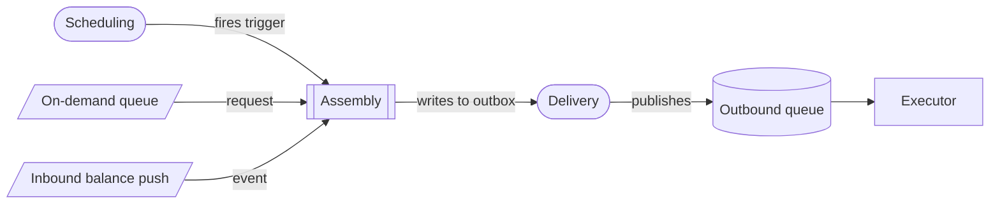
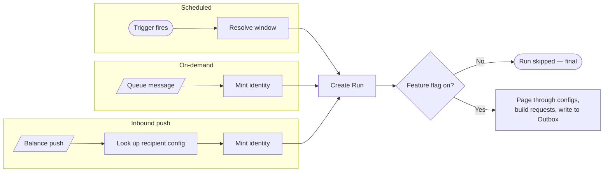
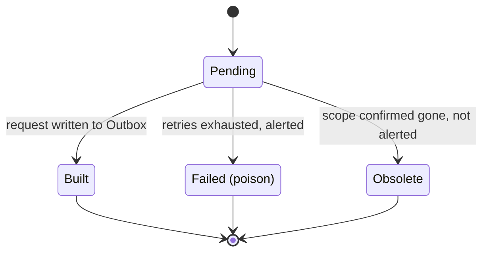
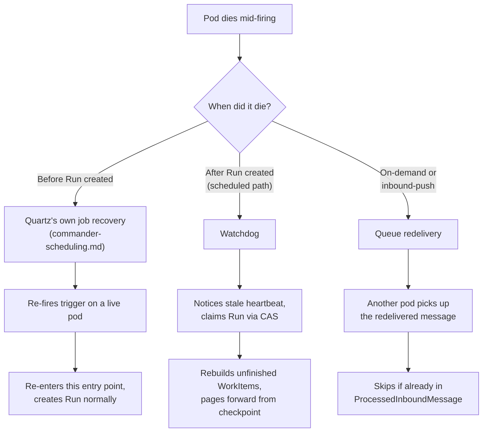
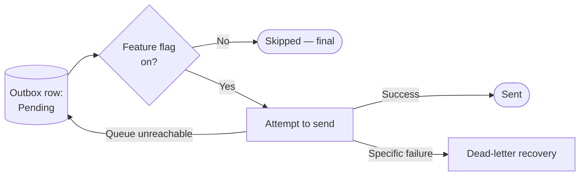

# 1. Overview

Corporate Reporting — the product offering that delivers CAMT reports to corporate banking customers — is powered by two purpose-built applications, each owning a distinct, non-overlapping stage of the process:

* **Commander** owns the decision of *when* a report is due. It schedules and validates report generation, resolves the applicable report configuration for each customer, and publishes a report generation request — a structured message, not a report — onto a queue for the Executor application to process. Commander never renders or generates the report itself.

* **Executor** owns the *production* of the report. It consumes report generation requests from the queue and generates the final ISO 20022 CAMT report for delivery to the customer.

Together Commander & Executor gives corporate customers automated, reliable delivery of ISO 20022 CAMT reports — on a schedule, on demand, or reactively when an account event occurs — without losing or duplicating a report even when the underlying infrastructure fails mid-task. Also allowing operations to pause, resume, backfill, or trigger a report on demand directly, without requiring a code change or redeploy.

This solution document is scoped to **Commander** only.

## 1.1 Conceptual Overview

Commander is the CAMT report-generation orchestration component for Corporate Reporting. Its purpose is to produce report-generation requests for CAMT reports — CAMT.052 intraday account reports, CAMT.053 end-of-day statements, and CAMT.054 debit/credit notifications — for every configured recipient, whether triggered by a schedule, an on-demand customer request, or an inbound account event. 

For each report-generation request, Commander determines what is due, retrieves the required data, assembles the request, and reliably publishes it to a queue. Commander's responsibility ends once the request has been durably published.

Commander is made up of three sub-components. 

- **Scheduling** - Reads and validates the deploy-time schedule configuration, builds and registers the underlying Quartz jobs and triggers, keeps the registration clean across redeploys, and runs the clustered scheduler. It also provides the window-calculation logic — rolling, boundary, or calendar-day — as a shared capability. Documented in full in its own companion document, `commander-scheduling.md`.

- **Assembly** - Owns the entry point for every report trigger: a scheduled firing initiated by Scheduling, an on-demand request, or an inbound account balance push. Regardless of the trigger, Assembly follows the same core flow: resolve the reporting window, create a tracking record, verify that the report type is enabled, retrieve the required data (via the Data Retrieval capability, documented in full in `commander-data-retrieval.md`), determine the request shape (bundled, unbundled, or configuration-only), build the report-generation request(s), and write each completed request to the outbox. The outbox is the handoff point from Assembly to Delivery.

- **Delivery** - Runs continuously on every pod and drains completed requests from the outbox, publishing them to the outbound queue. It handles publishing failures, retries, and dead-letter recovery.

## 1.2 Scope and Acceptance Criteria

## 1.3 Information Relevant for Prioritization

## 1.4 Architectural Decisions

1. **No cross-trigger lock between a scheduled run and an on-demand request.** An earlier design had a table whose whole purpose was to make a scheduled run and an on-demand request for the same configuration take turns rather than both proceeding — the opposite of the confirmed product decision that both should always be delivered, distinguished by trigger metadata. The lock added real complexity (an expiry, a locking query, a "claim expires during recovery" edge case) for no remaining correctness benefit once both trigger types already carry distinct fingerprints, so it was dropped entirely.

2. **A scheduled request's identity is derived from its scheduled fire time, not a fixed placeholder.** Earlier drafts gave every scheduled-path request the same placeholder identity, which meant a real firing and any later firing for the same window collapsed into one request — fine in production, since a given window only fires once, but it broke fast-cadence testing, where every test tick is supposed to produce a fresh request. Basing the identity on the scheduled fire time fixes this: the same slot (crash recovery, or a misfire catch-up landing on the same boundary) still produces the same identity and still deduplicates, while a genuinely distinct firing (a fast test tick, or a manual re-run with no explicit slot) produces a fresh one.

3. **Spring Batch was considered and rejected.** Its step-level restart granularity, a second metadata schema alongside Commander's own tables, and event-driven triggers (scheduled, on-demand, PHT) not fitting its batch-launch model made it a worse fit than Commander's own resolve-build-outbox-done loop.

4. **Recovery redoes assembly for still-incomplete work on resume, rather than checkpointing resolution separately.** Recovery already re-resolves each page's data exactly as normal processing does, so a separate resolve-checkpoint would only save re-doing assembly for items already cheaply resolved — not worth the added retention job and complexity it would require unless profiling later shows otherwise. Three independently deployed and monitored sweepers were also rejected as a recovery approach: real added operational surface with no stated need behind it.

5. **On-demand and inbound-push queue consumers use manual (client) acknowledgment, never a framework's default auto-acknowledge.** The crash-recovery story for these two paths depends entirely on it: a message is only acknowledged — and therefore only removed from the queue — after its Run has been durably recorded. Under auto-acknowledge, the message is removed the instant it's delivered, before processing even starts; a crash right after delivery would lose it silently, with nothing left for the queue to redeliver. This must be an explicit consumer configuration, not left to a default.

6. **A Run's identifier is threaded through every log line it produces, and each request's own identity is threaded through the request payload itself.** From the moment a Run is created (or an on-demand/inbound-push identity is minted) through building requests, publishing, and any recovery activity, every log statement carries that Run's identifier — one correlation id for tracing all the activity behind a single triggered run. Independently, each request's own identity — the same fields that make up its fingerprint — is embedded in the request payload Executor receives, so a single request's journey can be traced end-to-end from Commander's own logs through to Executor's processing, using the identity Commander already assigned it. Without this, tracing one report end-to-end has no shared thread to follow.

7. **A request-size ceiling, tied to IBM MQ's message-size limit (100MB), applies to the bundling rule.** A Bundled configuration merges every payment type and every account or alias into one request, which — for an unusually large configuration — could in principle exceed that limit; Unbundled and Configuration-only requests are structurally bounded and never at risk. If a built request would exceed the ceiling, its WorkItem fails immediately as poison (1.7, C) rather than being sent: the size is a deterministic property of that configuration's own data, so retrying changes nothing. This surfaces as an alert an operator can act on — most naturally by reconfiguring that customer as Unbundled instead.

8. **Run and WorkItem rows are retained for 90 days after reaching a terminal state, except Abandoned Runs and Failed-poison WorkItems, retained for 1 year to support incident investigation. Outbox rows are retained for 1 year regardless of outcome, since they're the closest thing Commander keeps to an actual delivery record.** No regulatory retention requirement applies to this data; these are operational defaults, not compliance minimums, and can be revisited if either changes.

9. **The request payload is built from its own dedicated structure, never a domain object reused elsewhere in the codebase.** A legacy incident broke Executor's deserialization when a shared domain class picked up new helper methods added for an unrelated reason, and the serializer picked those up automatically as if they were new fields — nobody intended to change the message, it changed as a side effect of touching something else. A dedicated, single-purpose structure for the payload closes this off entirely: nothing else in the codebase touches it, so nothing else can accidentally reshape it.

10. **New fields are additive-only; Executor ignores fields it doesn't recognize rather than failing on them.** Existing fields are never renamed or removed. This lets Commander add new information to the payload at any time without requiring a simultaneous Executor deploy — Executor keeps working unaffected until it's updated to actually use the new field. A genuinely breaking change (removing or restructuring an existing field) is handled as a new report type, not an in-place change to an existing one — kept rare by design, not the normal evolution path.

11. **The on-demand path defends against a `NEVER`-marked (PHT-only) configuration appearing in its request, with a skip-and-log check.** The on-demand path takes an explicit list of configuration ids and doesn't filter by frequency, so a mistaken inclusion is possible even though the product guarantee is that it shouldn't happen. Rather than trust that guarantee alone, or fail the whole request over one bad id, Commander checks each supplied configuration's frequency: a `NEVER` configuration is skipped and logged against the Run, and the rest of the request proceeds normally.

12. **`ProcessedInboundMessage` rows are retained for 24 hours.** This needs to exceed the worst-case time a legitimate redelivery could still arrive — a row purged before that window closes would be treated as a new message and reprocessed, silently reopening the exact duplicate-processing risk this table exists to close. 24 hours is a provisional estimate (up to 5 redelivery attempts, each potentially requiring a replacement pod to reconnect, at roughly 5-10 minutes per restart) pending confirmation against the actual backout-threshold and redelivery configuration on the on-demand and PHT queues, and should be revisited once that's known.

## 1.5 Assumptions and Pre-Requisites

- Executor, the downstream application that consumes Commander's published requests, deduplicates on each request's identity (trigger type, configuration, report type, scope, window, and execution id) — necessary because delivery from Commander is at-least-once, not exactly-once (see 1.6, Delivery).
- Executor accepts two requests that are semantically equal — same configuration, window, and data — as long as they're distinguished by trigger metadata. A scheduled request and an on-demand request for the identical configuration and window are both valid, independent deliveries, not duplicates of each other.
- Executor processes each request independently, with no dependence on delivery order.

## 1.6 Logical View - Architecture Scope

Commander's architecture is described here as a set of logical components, grouped under the three sub-components introduced in 1.1, followed by how those components interact.

### Scheduling

Scheduling's full architecture — startup sequence, the window-calculation function and its three shapes, cron generation, the clustered scheduler, and the admin control surface — is documented in its own companion document, `commander-scheduling.md`. The facts Assembly depends on directly are covered below, under Handoff boundaries.

### Assembly

- **The three trigger entry points** — one for each way a run can start, all converging on the same core flow (resolve the window, create a Run, check the feature flag, retrieve data, determine the request shape, build the request(s), write to the outbox):
  - **Scheduled** — invoked directly by Scheduling's clustered scheduler when a registered trigger fires. Resolves the window via Scheduling's window function, using the trigger's scheduled fire time — never the wall-clock time it happened to wake up at.
  - **On-demand** — a queue listener that receives a message carrying a list of configuration ids and mints a fresh identity for the request.
  - **Inbound account balance push** — a queue listener that receives an inbound message carrying account balances, and resolves the recipient's configuration from an identifier in the message.
- **Run** — one row per triggered run, the durable record of that run's progress. Holds a heartbeat, how far the run has got, and, for a scheduled run, the report type, frequency, scheduled fire time, and window start/end. A report-type feature flag that is off stops the run here, final — nothing further is created.
- **WorkItem** — one row per request Assembly intends to produce, written in full, page by page, before any of those requests are actually built, so a crash never loses track of what was planned.
- **Outbox** — one row per finished request, held here until Delivery sends it. This is also where duplicate prevention happens: every row carries a fingerprint — an identity built from the configuration, report type, data slice, time window, trigger, and the specific occurrence of that trigger — and Outbox refuses to ever hold two rows with the same one. That same identity is embedded in the request payload for end-to-end tracing (1.4, decision 6).
- **ProcessedInboundMessage** — a record of which incoming queue messages (on-demand requests, inbound balance pushes) have already been fully handled, so a redelivered message after a near-miss crash isn't processed a second time.
- **The watchdog** — a clustered job, reusing the same Quartz clustering Scheduling uses, that watches for a run whose owning pod has gone quiet (a stale heartbeat) and resumes it. Deliberately separate from Quartz's own job-recovery feature, which only covers a pod dying before a Run exists in the first place.

### Delivery

- **The drain loop** — a loop every pod runs at once, continuously draining finished requests from the outbox onto the real outbound queue. A claim on each row stops two pods sending the same one twice.
- **Publish-failure handling** — retries with backoff and jitter; if the queue itself is unreachable, the row simply stays PENDING and is picked up again on the next pass. A request that fails specifically at delivery, rather than the queue being unreachable, is handled through dead-letter recovery.
- **Delivery is at-least-once, not exactly-once.** A row can be sent successfully and then redelivered if the pod that sent it dies before marking it done — sending and marking done aren't one atomic step. Every request carries its own fingerprint, and Executor is expected to dedupe on it (see 1.5, Assumptions).

An Outbox row ends in one of three states:

- Pending — waiting to be sent, or waiting for the next retry if an earlier attempt failed to reach the queue.
- Sent — successfully published onto the outbound queue.
- Skipped — the report type's feature flag was off at send time (see 1.7, Delivery).

### Handoff boundaries

- **Scheduling → Assembly** — Scheduling's clustered scheduler invokes Assembly's scheduled-trigger entry point directly when a registered trigger fires, passing it that trigger's own configuration data (report type, frequency, scheduled fire time). Assembly resolves the window itself from there, using Scheduling's window function.
- **Assembly → Data Retrieval** — Assembly calls Data Retrieval's fresh-resolution entry point with a set of configurations (or its recovery entry point, for already-known pieces of work), and gets back one resolved structure per configuration. Documented in full in `commander-data-retrieval.md`.
- **Assembly → Delivery** — via the outbox: Assembly writes each finished request there, and Delivery drains it independently.
- **Assembly → Executor** — the finished, published request is the full extent of what Commander hands over. Commander has no visibility into anything Executor does with it afterward.

## 1.7 Workflow / Process Flow

### Scheduling

**A. When a schedule fires**

1. The timetable is due. Because the scheduler runs in clustered mode, exactly one pod across the whole deployment picks up the firing — a property of the clustering technology itself, not something the application has to coordinate.
2. That pod invokes Assembly's scheduled entry point directly, passing it the trigger's own configuration data — report type, frequency, and scheduled fire time (see Assembly, A, below).

**B. When a firing is missed**

A missed firing is never automatically caught up, whatever the cause — an outage, or a deliberate pause. The timetable simply resumes at its next natural time; recovering a missed slot is always a deliberate Backfill. The full misfire policy, Backfill mechanics, and the Pause/Resume operational runbook for a known database or message-queue issue are documented in `commander-scheduling.md` (Sections 4 and 5).

**C. Reliability behaviours worth knowing**

- Scheduling places no mutual-exclusion lock between firings of the same schedule — each registered trigger fires and invokes Assembly's entry point independently of any earlier firing's status. Whether Assembly then allows two Runs for the same schedule to proceed concurrently is Assembly's own decision (see Assembly, E, below).
- Recovery from a pod dying at any point — before or during a run — is covered in full under Assembly, D, below.

### Assembly

**A. The three ways a run starts**

Scheduled:

1. Scheduling's clustered scheduler invokes this entry point directly when a registered trigger fires (see Scheduling, A, above).
2. It resolves the window using Scheduling's window function, from the time the firing was scheduled for — never the wall-clock time it happened to wake up at. For a normal firing these are the same instant; the distinction matters for a manual backfill or a recovered run, where the report must cover the period it was meant to, not whenever it actually ran.
3. It creates a Run as its first durable action — precisely so that anything that goes wrong afterward leaves a trace recovery can act on. A repeated attempt to create a Run for a slot that already has one is a harmless no-op: whichever attempt gets there first wins, and any other attempt for the exact same slot finds it already exists and exits without doing further work.
4. It checks a feature flag for that report type. If the flag is off, the Run is marked skipped right there and nothing further happens — no configurations are resolved, nothing is built. If the flag is on, it works through the matching configurations in pages of around 500 at a time: fetch the next page, retrieve each configuration's required data in one batch (via Data Retrieval — `commander-data-retrieval.md`), decide how many requests each configuration produces (B, below), write those as WorkItem rows, then for each one: build the request, write it to the Outbox, mark it done, before moving to the next page.

A skipped Run still occupies that slot — that is final, not something to backfill. If that window's report is still wanted, that is an on-demand request instead, not a retry.

On-demand:

1. A message arrives on the on-demand queue, carrying a list of configuration ids.
2. The pod that picks it up mints a fresh identity for this request — nothing is supplied by the caller.
3. It creates a Run and runs the same resolve-build-outbox-done loop as the scheduled path, for those configurations — except any supplied id marked `NEVER` (PHT-only), which is skipped and logged against the Run instead (1.4, decision 11), rather than processed or failing the whole request.
4. It records the incoming message's id as handled and acknowledges the queue.

Inbound account balance push:

1. An inbound message arrives carrying account balances.
2. The pod parses it and works out the recipient from an identifier in the message.
3. It looks up that recipient's configuration — the one Scheduling never touches, since it's marked with a frequency Scheduling structurally excludes.
4. It mints a fresh identity for this request, the same as on-demand.
5. It builds one request carrying those pushed balances and writes it to the Outbox.
6. It records the incoming message as handled and acknowledges the queue.

A Run ends in one of four states:

- In progress — still being worked by its owning pod.
- Completed — every WorkItem it produced has reached a terminal state.
- Skipped — the report type's feature flag was off at creation (1.6, Assembly, above).
- Abandoned — recovery kept failing past a set number of attempts; final, with an alert for a person (D, below).

**B. The bundling rule — what "one WorkItem" means**

A single configuration can turn into one request or many, depending on how it's set up:

- Bundled — one request for the whole configuration, covering every payment type it has, each carrying all of that type's accounts or aliases, merged across every scope.
- Unbundled — one request per account or alias.
- Configuration-only — one request covering just the configuration itself, with no scope attached.

The WorkItem rows are written to match this exactly, which is also why they can only be written after a configuration's data has been retrieved — there's no way to know how many requests a configuration produces before then. A Bundled request has no upper bound on how much it merges together, which is why it's the one shape subject to the message-size ceiling (1.4, decision 7).

**C. How a WorkItem ends**

Every WorkItem finishes in exactly one of these states:

- Built — its request is in the Outbox. This means produced, not delivered; what happens to it after is covered under Delivery, below.
- Failed (poison) — tried several times and keeps failing, usually because of bad data, or fails immediately because the built request exceeds the message-size ceiling (1.4, decision 7). Final, and it raises an alert; the rest of the run carries on regardless.
- Obsolete — during recovery, the account or scope this item was for turned out to have been genuinely removed, confirmed by an actual lookup rather than one that merely failed or timed out — Data Retrieval's recovery entry point (`commander-data-retrieval.md`) is what makes that distinction. Logged, done, not an alert. A lookup that only failed or timed out is treated as an ordinary failure and retried instead — a temporary hiccup must never quietly retire real work.

**D. When a pod dies**

A scheduled run: while a run is active, its pod updates a heartbeat on the Run regularly. The watchdog (1.6) is a clustered job that fires on a short interval, so only one pod's watchdog tick is ever scanning for a stale heartbeat at a time, and that same pod is the one that discovers a stale run, claims it (safely, so only one pod wins even if two ticks overlap), and resumes it immediately, in that same execution. Resuming means two things: re-fetching and rebuilding any WorkItems left unfinished (via Data Retrieval's recovery entry point, which answers found / confirmed-absent / query-failed for each — `commander-data-retrieval.md`; safe to redo regardless, since the Outbox's fingerprint rule simply rejects anything already built before the crash), and continuing to page forward from wherever the dead pod left off, exactly as normal processing would. A run that keeps failing recovery past a set number of attempts is marked abandoned, with an alert for a person.

A pod dying before it even manages to create the Run in the first place is a different, narrower case: Quartz's own job recovery (see `commander-scheduling.md`, Logical components) simply re-fires the trigger on a live pod, which re-enters this entry point and creates the Run normally, the same as any other attempt for a slot that doesn't have one yet.

An on-demand or inbound-push run: much simpler, and needs no watchdog. These arrive as queue messages, so if a pod dies before finishing one, the queue itself automatically redelivers it to another pod, which starts over — a guarantee that depends on manual acknowledgment (1.4, decision 5): the message stays unacknowledged, and therefore eligible for redelivery, until its work is durably recorded. To avoid reprocessing a message that actually finished just before the crash-and-redeliver, Commander records the id of every incoming message it completes (ProcessedInboundMessage) and skips any it has already seen.

**E. Reliability details worth knowing**

- Assembly places no mutual-exclusion lock on Runs for the same report type and frequency. If an earlier window's Run is still in progress when the next window's trigger arrives, Assembly creates a new Run and processes it independently — a slow run must never hold back the next window's report.
- Different trigger types are never deduplicated against each other. A scheduled run and an on-demand request can target the very same configuration and window on purpose, and both are produced and delivered — a request's fingerprint includes which trigger produced it, so the two carry different fingerprints and neither blocks nor suppresses the other.
- Feature flags are checked at exactly two points and nowhere in between: once here, at Run creation, and once more by Delivery immediately before sending (see Delivery, below). Both checks are final. A WorkItem always ends up "built" once it exists, regardless of what Delivery later decides about actually sending it.
- There is no ordering guarantee between published requests. Every request is self-contained, and Executor is expected to process each one independently.
- The reporting window always reflects when a run was scheduled for, never when it actually ran, so a delayed or recovered run still produces exactly the window it was meant to.
- A pod's heartbeat write failing because the database is unreachable is safe, even once the database comes back. The watchdog may then perceive several runs as stale all at once, but the same claim mechanism that already protects against two watchdog ticks overlapping applies here too — only one pod ever actually resumes a given run, regardless of how many runs look stale at the same moment.
- Pause and Resume (Scheduling's admin actions) only stop scheduled firings — they have no effect on on-demand requests or inbound pushes, which arrive over the message queue rather than through Quartz. During a known database problem, pausing the affected schedules is only a partial mitigation: on-demand and push traffic keeps arriving and keeps hitting the same struggling database, relying on the queue's own redelivery as its safety net rather than on anything Assembly does deliberately. This is safe (no data loss, no duplication) but potentially noisy, and remains an open item for the team.

### Delivery

- The drain loop continuously drains finished requests from the Outbox onto the real outbound queue, retrying failed publish attempts with backoff and jitter.
- Immediately before sending a given row, it checks that report type's feature flag one final time; if off, the row is marked done without being sent, final, not retried, not alerted (see Assembly, E, above, for the full two-check story).
- If the queue itself is unreachable, the outbox row simply stays PENDING; the next pass picks it up again once the queue is reachable. Nothing is lost and nothing needs to be specially detected.
- A request that fails specifically at delivery, rather than the queue being unreachable, is handled through dead-letter recovery.

## 1.8 \<Relevant name\>

## 1.9 \<Relevant name\>

## 1.10 \<Relevant name\>

...

## 1.x \<Relevant name\>

# 2. Implementation Reference

<!-- Open item (noted 2026-09-19): add the DB model here once this section is built —
     a Mermaid erDiagram for the visual (Run, WorkItem, Outbox, ProcessedInboundMessage
     and their relationships) plus the actual CREATE TABLE SQL as reference text.
     Not raw DBML — Confluence renders Mermaid natively, not DBML; DBML by itself needs
     an external tool (e.g. dbdiagram.io) to become a picture. Source: schema.dbml /
     solution_v08.md in 02-design/message-pipeline/. -->

